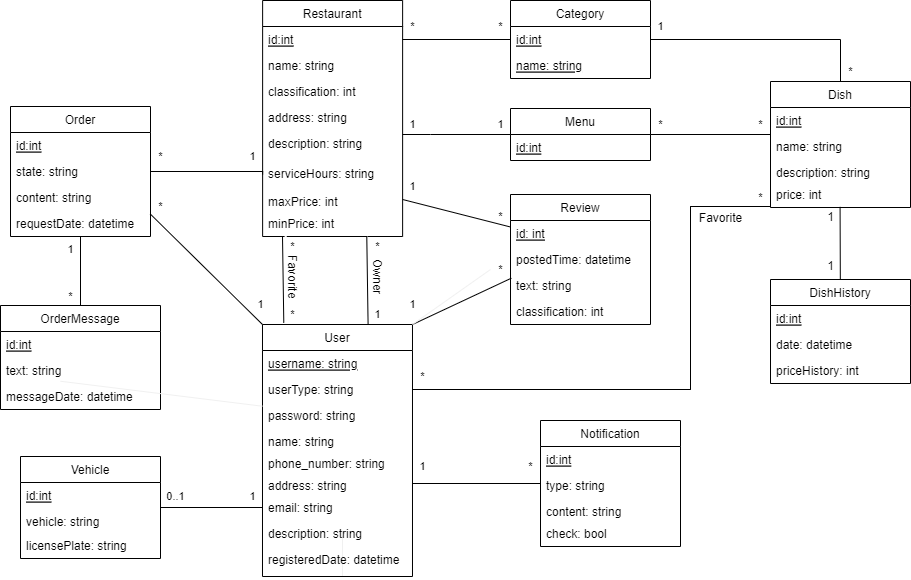
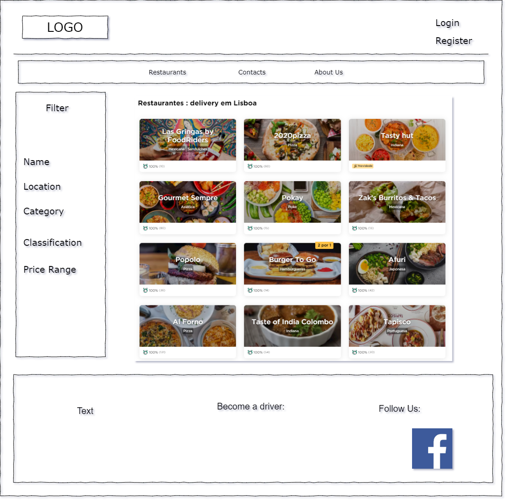
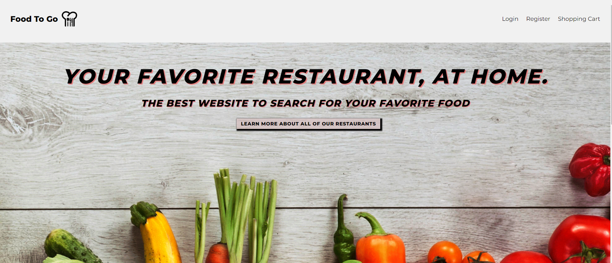
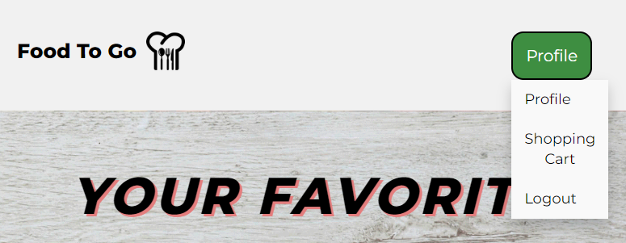
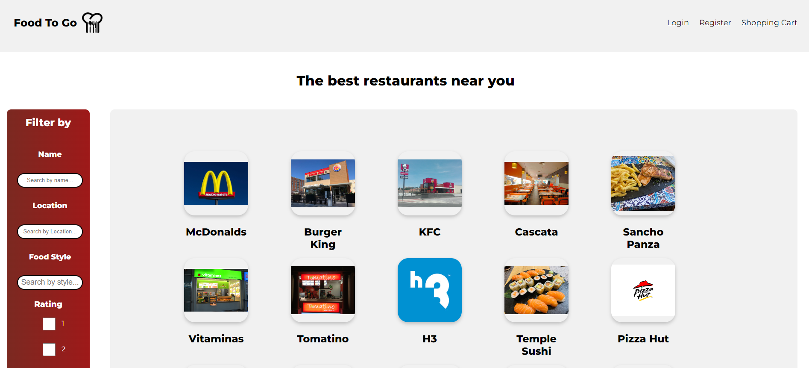
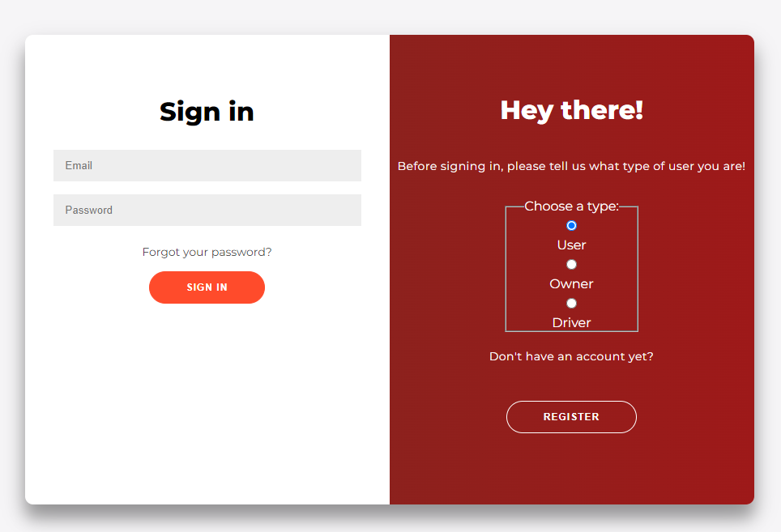
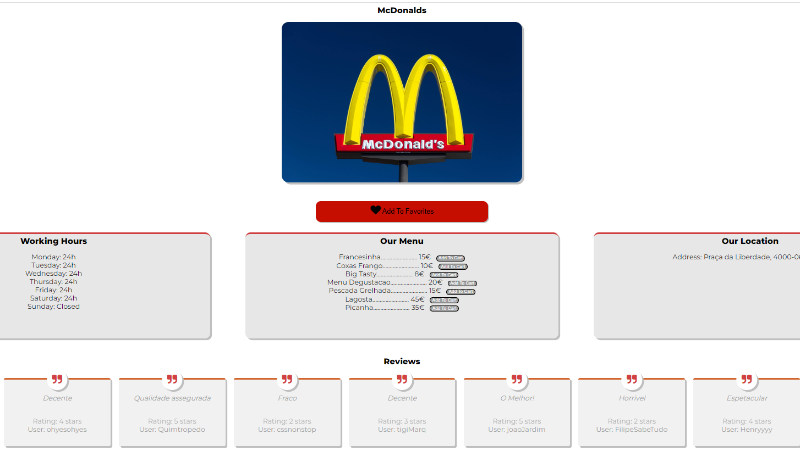

# LTW-Proj-2022

## FEUP - L.EIC - University of Porto

**Project Authors:**

>Alberto Serra 
>Miguel Tavares 
>João Duarte

## Database

**UML**

**Relation Model**

Restaurant(<ins>idRestaurant</ins>, name, classification, address, description, serviceHours, maxPrice, minPrice, username->User, idMenu->Menu) 
User(<ins>username</ins>, userType, password, name, phoneNumber, address, email, description, registrationDate) 
Category(<ins>idCategory</ins>, name) 
Dish(<ins>idDish</ins>, name, description, price, idCategory->Category) 
Menu(<ins>idMenu</ins>) 
Vehicle(<ins>idVehicle</ins>, vehicle, licensePlate, username->User) 
Review(<ins>idReview</ins>, postedTime, text, classification, username->User, idRestaurant->Restaurant) 
Notification(<ins>idNotification</ins>, type, content, check, username->User) 
Order(<ins>idOrder</ins>, state, content, requestDate, username->User, idRestaurant->Restaurant) 
OrderMessage(<ins>idOrderMessage</ins>, text, messageDate, idOrder->Order) 
DishHistory(<ins>idDishHistory</ins>, date, priceHistory, idDish->Dish) 
RestaurantCategory(<ins>idRestaurant</ins>->Restaurant,<ins>idCategory</ins>->Category) 
MenuDish(<ins>idMenu</ins>->Menu, <ins>idDish</ins>->Dish) 
FavoriteRestaurant(<ins>idRestaurant</ins>->Restaurant, <ins>idUser</ins>->User) 
FavoriteDish(<ins>idDish</ins>->Dish, <ins>idUser</ins>->User) 

## Mockups

### Example ...

<i>All the examples are included in the mockup directory.</i>

**Main page layout**

## Final Front End Design

### Some examples ...

<i>All the images are included in the mockup directory.</i>

**Non Logged Header**

**Logged In Header**

**Main Page**

**Forms General Design**

**Restaurant Page**

# Finished and Functional Features

>All features that are fully functional and successfully completed.
- [x] Register
- [x] Login/Logout
- [x] Edit Profile
- [x] Mark Restaurant as Favourite
- [x] List favorite restaurants on user's profile
- [x] Search Restaurants by name
- [x] Search Restaurants by location
- [x] Search Restaurants by foodstyle
- [x] Search Restaurants by rating
- [x] List Reviews by restaurants
- [x] List all the restaurants
- [x] List dishes by restaurant's menu
- [x] List restaurants information (location and working hours)

## Credentials

outlet@gmail.com / abcd77HHeg  `owner` 
quimrapina@gmail.com / abcdei `driver` 
filipe@gmail.com / abc92KSK `customer` 

# Unfinished Started Features

>All features that already have some kind of work associated with them. 
>Features that have actions and methods in classes that are not yet functional 
> but present in the project.

- [ ] Change Order State
- [ ] Order Dishes
- [ ] List My Orders
- [ ] Customer Can Leave a Review
- [ ] Mark Dish as Favourite
- [ ] Restaurant Owner Can Answer to Review
- [ ] Add Restaurant
- [ ] Edit Restaurant
- [ ] Add Dishes
- [ ] List Customer Orders
- [ ] Remove favorite restaurants from user
- [ ] Add vehicle to driver 
- [ ] Edit driver's vehicle

# Security 

>Parts of the code that were designed to strengthen the site's security level.

- Password edits has an hash verification in the User class.
- Usage of htmlspecialchars function in Sign Up User.
- Usage of filter_var with FILTER_SANITIZE on setting variables.
- Exceptions were used in some functions in the project as well as try and catches.
- PDO verification variables in binding variables in functions.
